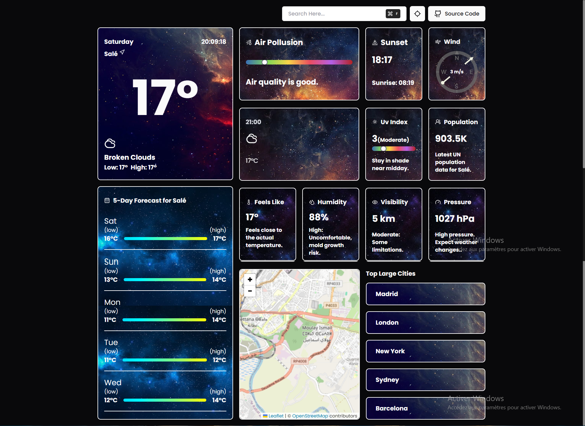

# **Advanced Weather App**

Welcome to the **Advanced Weather App**! This comprehensive weather application leverages the OpenWeather API to deliver accurate and detailed weather data, including air pollution, UV index, and multi-day forecasts. Built with **React.js** and **Next.js**, the app is fast, responsive, and customizable.



## **Visit the App:SONN** [Advanced Weather App](https://your-weather-app-url.vercel.app/)

---

## **Table of Contents**

- [About the Project](#about-the-project)
- [Features](#features)
- [Components](#components)
- [Technologies Used](#technologies-used)
- [Installation](#installation)
- [Usage](#usage)
- [Contact](#contact)

---

## **About the Project**

The **Advanced Weather App** provides users with in-depth weather insights for any location worldwide. It combines modern UI design with accurate weather data, ensuring users get the information they need for daily and long-term planning.

---

## **Features**

- **Real-Time Weather Data:**
  - Current temperature, "feels like" temperature, and weather conditions.
  
- **5-Day Weather Forecast:**
  - Detailed forecasts with hourly and daily breakdowns.

- **Air Quality Index (AQI):**
  - Displays air pollution levels and their health impact.

- **UV Index:**
  - Sun protection advice based on UV levels.

- **Additional Metrics:**
  - Wind speed and direction.
  - Humidity, visibility, and atmospheric pressure.
  - Sunrise and sunset times.

- **Interactive Map:**
  - View weather conditions on an interactive map powered by **Mapbox**.

- **Search Locations:**
  - Find weather data for cities and coordinates globally.

- **Responsive Design:**
  - Optimized for all devices: desktops, tablets, and smartphones.

---

## **Components**

This app is modular and built with reusable React components. Below is a list of key components:

1. **Air Pollution**: Displays AQI and detailed pollution metrics.
2. **Daily Forecast**: Provides weather data for the current day.
3. **Feels Like**: Shows perceived temperature based on humidity and wind.
4. **5-Day Forecast**: Graphical representation of weather trends for five days.
5. **Humidity**: Indicates the percentage of atmospheric moisture.
6. **Mapbox**: Interactive map showing weather overlays for selected locations.
7. **Population**: Highlights population density or city size based on weather data.
8. **Pressure**: Displays atmospheric pressure readings.
9. **Search Dialog**: Allows users to search for cities or locations.
10. **Sunset/Sunrise**: Provides timings for sunrise and sunset.
11. **Temperature**: Shows the current temperature and weather icon.
12. **UV Index**: Displays UV levels and safety recommendations.
13. **Visibility**: Indicates visibility range in kilometers or miles.
14. **Wind**: Provides wind speed and direction details.

---

## **Technologies Used**

- **Frontend:**
  - React.js
  - Next.js
  - Tailwind CSS for responsive styling

- **API:**
  - OpenWeather API for weather and pollution data

- **Utilities:**
  - Mapbox for interactive mapping
  - Context API for global state management

- **Tools:**
  - Axios for API calls
  - React Icons for weather icons

---

## **Installation**

To set up the project locally, follow these steps:

1. **Clone the repository:**
   ```bash
   git clone https://github.com/khalid-tourhzaoui/WEATHER-APP.git
   ```

2. **Navigate to the project directory:**
   ```bash
   cd WEATHER-APP
   ```

3. **Install dependencies:**
   ```bash
   npm install
   ```

4. **Start the development server:**
   ```bash
   npm run dev
   ```

5. Open your browser and go to `http://localhost:3000` to view the project.

## **Usage**

Once you have set up the project locally, you can start using the app with the following features:

### 1. **Search Locations**
   - In the app, there is a **Search Bar** where you can input a city name or geographical coordinates (latitude and longitude).
   - Type the name of the city or enter the coordinates (e.g., `40.7128, -74.0060` for New York City) to fetch the weather data for that location.

### 2. **Real-Time Weather Data**
   - The app will display the **current weather conditions** for the selected location, including:
     - **Temperature** (current and feels like)
     - **Weather Conditions** (e.g., sunny, rainy, cloudy)
     - **Humidity**
     - **Wind Speed and Direction**
     - **Pressure**
   
   The current weather data will be updated in real time based on the location you choose.

### 3. **Air Quality Index (AQI)**
   - The **Air Quality Index** section shows pollution data for the location, including:
     - **AQI Level**: A value indicating the pollution level (good, moderate, unhealthy, etc.)
     - **Health Recommendations**: Based on the pollution level, the app provides guidance on whether the air quality is safe or harmful.
  
### 4. **UV Index**
   - The **UV Index** is displayed along with recommendations for sun protection based on the level of ultraviolet radiation.
   - If the UV index is high, the app will suggest wearing sunscreen, sunglasses, and protective clothing.

### 5. **5-Day Weather Forecast**
   - The app displays a **5-day weather forecast**, with hourly details for each day.
   - You can view weather conditions, temperature ranges, wind speed, humidity, and other metrics for each of the next five days.

### 6. **Interactive Map**
   - **Mapbox** integration allows you to visualize weather data on an interactive map. You can zoom in and out, and the weather overlays show current conditions for different locations globally.
   - The map updates dynamically as you search for new locations or interact with it.

### 7. **Responsive Design**
   - The app is designed to work smoothly across all devices:
     - **Desktop**
     - **Tablet**
     - **Mobile Phones**
   
   The layout automatically adjusts based on the screen size, ensuring a seamless experience for all users.


## **Contact**
- **Email:** [khalidtourhzaoui@gmail.com](mailto:khalidtourhzaoui@gmail.com)
- **LinkedIn :** [LinkedIn Profile](https://www.linkedin.com/in/khalid-tourhzaoui/)
- **My website:** [ Contact me](https://khalid-tourhzaoui.vercel.app/contactme)
